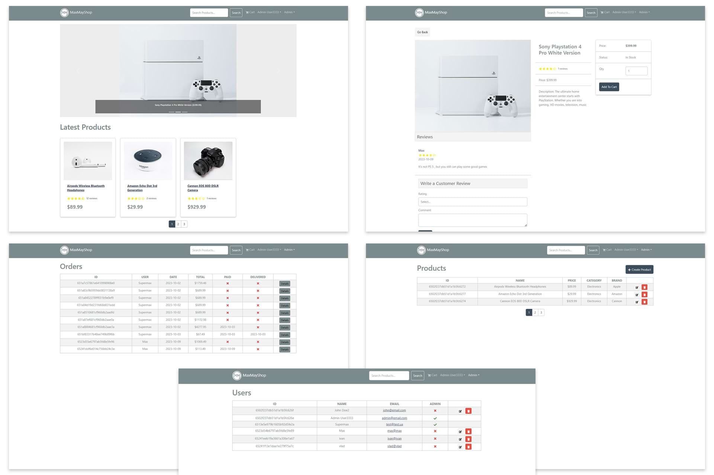

# MERN Stack eCommerce Platform

## Table of contents

- [Overview](#overview)
- [Links](#links)
- [What I learned](#what-i-learned)

## Overview

A full-featured eCommerce platform built with the MERN (MongoDB, Express, React, Node.js) stack. It includes a shopping cart, product search, admin area, PayPal integration, and more.

## Links

- Solution URL: [https://maxmayshop.onrender.com](https://maxmayshop.onrender.com)

## What I learned

- Create UIs with React and React Bootstrap.
- Manage state with Redux and Redux Toolkit.
- Build an advanced API with Node.js, Express, and MongoDB.
- Implement user authentication with JWT and HTTP-Only cookies.
- Use custom middleware for error handling and authentication.
- Organize the application with Mongoose models, controllers, and routes.
- Follow a full-stack structure and workflow.

This project is a comprehensive MERN stack application that covers the entire development process, from setting up the frontend to implementing advanced features and user authentication. Whether you're a beginner or an experienced developer, this project provides valuable insights into building a full-featured eCommerce platform.

Feel free to contribute, report issues, or use this project as a learning resource for your own applications.
